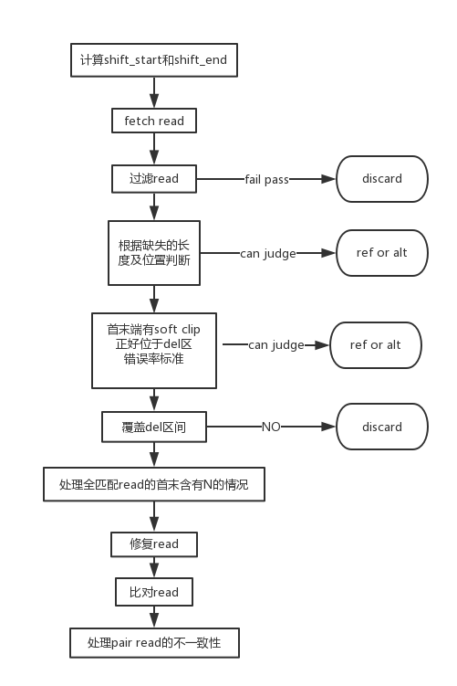
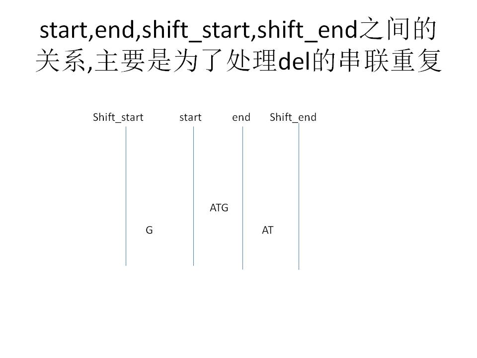
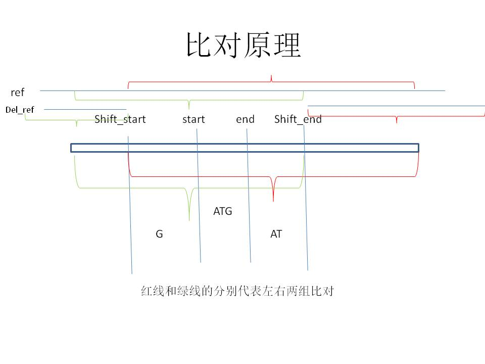
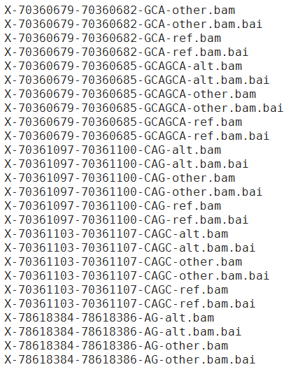
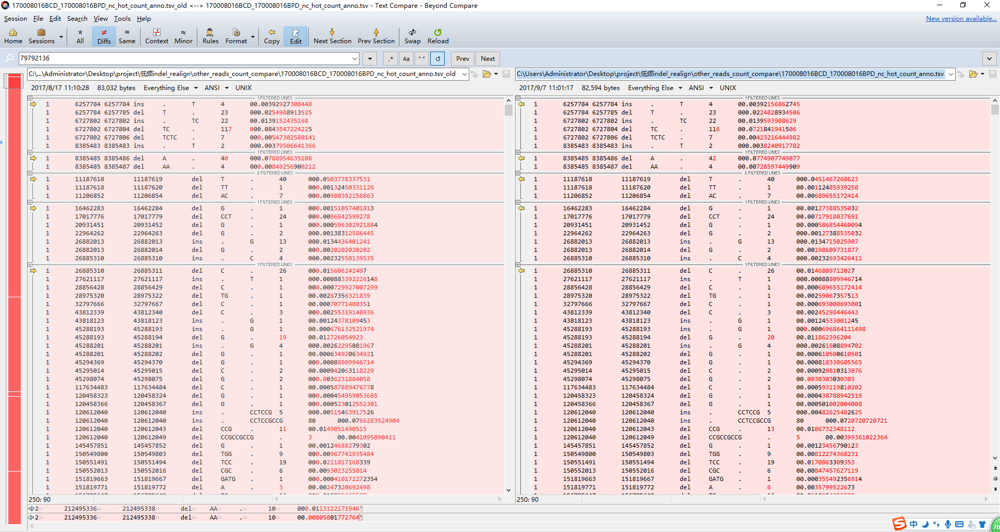

# Indel Correct

Table of Contents
=================
* [workflow](#workflow)
* [计算shift_start和shift_end](#compute-shift_start_and_shift_end)
* [fetch read](#fetch-read)
* [filter read](#filter-read)
* [处理含有缺失的read](#handle-del-read)
* [处理含有soft clip的read](#handle-soft-clip-read)
* [判断read是否覆盖del区域](#handle-uncover-del-read)
* [处理全匹配read的首末含有N的情况](#handle-N-in-start-end-or-both-fully-match-read)
* [修复read](#restore-read)
* [比对read](#compare-read)
* [处理不一致read pair](#handle-inconsistent-pair-read)

## workflow

## compute-shift_start_and_shift_end

## fetch-read
取star，end上下游各30bp区间的reads，如果不扩大区间，就有一些soft-clip的reads，在用pysam fetch时会被漏掉
## filter-read
过滤的标准
* read没有比对上
* mate read 没有比对上
* read 是重复序列
* “M”不在cigar里面
* 如果在del区域的read的序列全为N

## handle-del-read
* read 有缺失，且缺失从同一位置开始，但缺失长度与del长度不一样，则不是alt
* read 有缺失，且缺失的长度与位置和del的相同，则为alt
* 其它情况接着往后走

## handle-N-in-start-end-or-both-fully-match-read
* 比如70M，但二端或一端含有N，且在del的区间全部为N，则丢掉该read

## handle-soft-clip-read
* read的首端或末端有soft clip，且read match的位置与end(soft clip在read的左边)，start（soft clip在read的右边）之一相同，就可以与ref 或 del_ref进行比对，若与ref和alt完全一样，则为ref或alt
* 若mismatch>=3 或 错误率大于50%，则计入总深度。在此步进行判断，主要是为了过滤掉那些与ref和alt都有很大mismatch的read
* 其它情况接着往后走

## handle-uncover-del-read
* 若read未覆盖del区域，则coninue

## restore-read
* 对与我们所求的del无关的区域的insertion，deletion，soft-clip进行修正，以减少由于这些突变造成后续比对mismatch数偏高
* 修复soft clip时，我们只对大于10bp的clip进行修复

## compare-read

1.	shift_start之后的序列与对应位置ref 和del_ref 去做比对，记为右边的ref，alt的mismatch数
2.	shift_end之前的序列与对应位置ref 和del_ref 去做比对，记为左边的ref，alt的mismatch数
3.	分别计算ref和alt的mismatch总数，判断是ref还是alt

## handle-inconsistent-pair-read
如果pair reads，一条支持ref，一条支持alt，谁的mismatch数最少，即为支持谁。若mismatch数相等，则随机归入ref和alt

<h1 align = "center">del矫正</h1>
# github del矫正可参考的工具
[abra](https://github.com/mozack/abra)  
[abra2](https://github.com/mozack/abra2)  
[VarDictPerl](https://github.com/AstraZeneca-NGS/VarDict)  
[VarDictJava](https://github.com/AstraZeneca-NGS/VarDictJava)  

# bam可视化及工具
bam可视化查看工具：igv(Integrative Genomics Viewer)  
igv[website](http://software.broadinstitute.org/software/igv/)  
indel correct 的结果准确与否，都可以通过igv进行查看，因为每个位置测序的深度比较高，支持ref和alt的reads如果混在一块，在igv中看时，会比较混乱，可以为每个del分别生成ref和alt的bam，来查看     

# 结果文件的比较工具
  在写程序的过程中，改程序时，每次可以先生成一些中间结果，比如记录alt_support_reads_count,total_depth,alt_rate,可以保存下来，在每次修改后，可以纵向比较本次修改的结果与原来结果的比较，是否在修正一个bug的同时，又引入了其它的bug。需要从全局看一遍。纵向比较时，在windows上，可以采用beyond compare 文件对比工具，       
  

# del 矫正的主要思路
在比对时，要充分利用bwa的比对结果成的一些信息，比如read的cigar和blocks，根据blocks可以判断匹配的位置，根据cigar可以判断是否有插入，缺失，soft clip等。在read的首末一端或同时还有soft clip（比如5S65M）,还有全匹配（70M）,都可能存在N，当去掉N序列后，有可能不覆盖del区间，这种reads要去掉。大体上，主要处理4类

1. 全匹配的read
2. 首末端还有soft clip的read
3. 含有缺失的read
4. 以上3种情况组合而成复杂的read

# del correct的难点
cigar的样式可能多种多样，就算用正则能匹配，但要写出统一的处理逻辑思路是比较困难的。由于read中间的del，首末端的soft clip, 和一部分全匹配read(虽然是全匹配，但read序列和参考序列并不是完全一样)首末端的序列构成了alt的全部。主要纠正的是含soft clip的read和全匹配首末端含有短的支持alt的reads。

# del矫正应该考虑的情况
* 全匹配的read

# 其它
如果一条read的soft clip比较长，那么soft clip基本是不支持alt的，属于那种比较杂乱的read。

